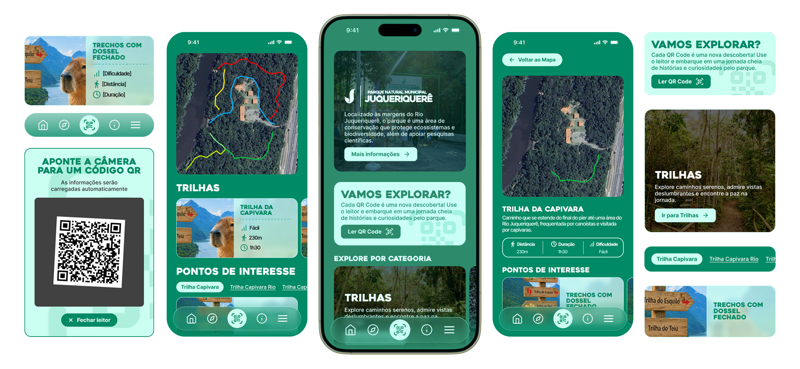

<h1 align="center">
    
    
</h1>

Repositório dedicado ao site do **Parque Natural Municipal do Juqueriquerê**, desenvolvido na matéria Projeto de Extensão I, lecionada por **Nelson Alves Pinto** no **IFSP Câmpus Caraguatatuba**

## Sobre o site 

O site do parque conta com diversas informações úteis para os que desejam visitar o espaço.

Desde pontos interessantes até dificuldades a serem enfrentadas, o sistema busca auxiliar e enriquecer ao máximo a visita ao parque, aprimorando ainda mais a experiência das belezas naturais brasileiras.

## Funcionalidades principais

- **Trilhas Didáticas:** Exibição das trilhas do parque de forma interativa, mostrando caminhos e pontos de interesse.
- **Interação com o Ambiente:** Integração com QR Codes espalhados pelo parque para identificação detalhada de locais e espécies.
- **Funcionamento Totalmente Offline (PWA):** Não se preocupe com o sinal de internet! Ao adicionar o site à tela inicial do smartphone, todas as informações essenciais continuam acessíveis.

## Tecnologias utilizadas

- **Front-end:** React / Vite / TypeScript
- **Estilização:** Framer-Motion
- **Funcionalidades:** Service Workers (PWA), QR Code Scanner API

## Equipe do projeto

| Foto | Nome | Posição |
| :---: | :--- | :--- |
|  | [Kauan Barbosa](https://github.com/kauangithub) | Desenvolvedor |
|  | [Lucas Hirotsu](https://github.com/lucashirotsu) | Desenvolvedor |
|  | [Matheus Costa](https://github.com/MRC0sta) | Desenvolvedor |
|  | [Rafael Ribeiro](https://github.com/rafaelribeiro398) | Desenvolvedor |
|  | [Ygor Prado](https://github.com/FatalRestart) | Desenvolvedor |
## Como rodar localmente


### 1. Código fonte
O código fonte pode ser obtido do repositório da seguinte forma:
```bash
git clone https://github.com/adsifspcaragua/juqueriquere
cd juqueriquere
```


### 2. Instalação das Dependências

Utilize o NPM para instalar todas as bibliotecas necessárias

```bash
npm install
```

### 3. Execução

#### 3.1 Execução num ambiente de desenvolvimento

Utilize o seguinte comando para rodar o servidor num ambiente de testes

```bash
npm run dev
```

Caso queira testar o funcionamento em outros dispositivos (como o celular) conectados na mesma 
rede Wi-Fi, utilize:

```bash
npm run dev -- --host
```
> [!NOTE]
>Em caso de erro de conexão em outros dispositivos, verifique seu firewall.
#### 3.2 Execução da compilação

Para gerar a versão final otimizada e testar o comportamento do PWA localmente:
```bash
# 1. Gera a pasta de build (dist)
npm run build
```
```bash
# 2. Executa o servidor de produção local
npx serve -s dist
```