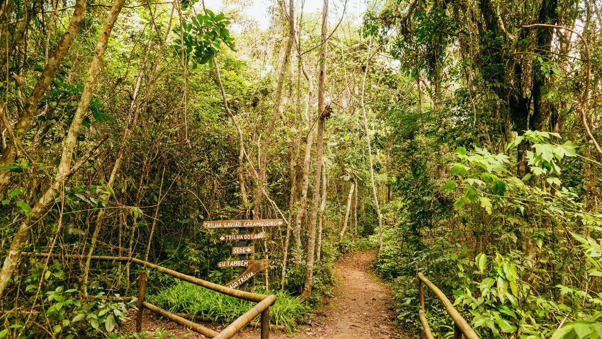

<h1 align="center">
    
    Juqueriquerê
</h1>

Repositório dedicado ao site do **Parque Natural Municipal do Juqueriquerê**, desenvolvido na matéria Projeto de Extensão I, lecionada por **Nelson Alves Pinto** no **IFSP Câmpus Caraguatatuba**

## Sobre o site 

O site do parque conta com diversas informações úteis para os que desejam visitar o espaço.

Desde pontos interessantes até dificuldades a serem enfrentadas, o sistema busca auxiliar ao máximo a visita ao parque, aprimorando ainda mais a experiência das belezas naturais brasileiras.

## Equipe do projeto

- Kauan Machado Barbosa
- Lucas Hirotsu
- Matheus Rodrigues Costa
- Rafael Ribeiro dos Santos
- Ygor da Conceição Prado

